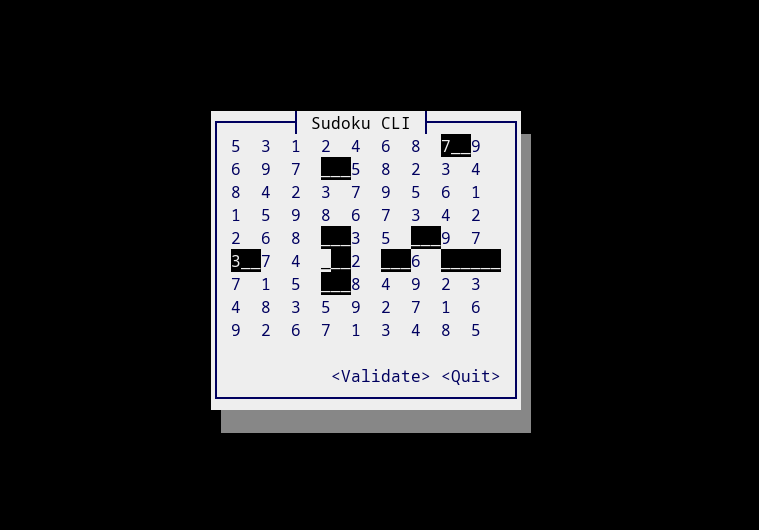

# sudoku-utils

Rust library providing Sudoku struct with the following functionalities on the Sudoku board:

- [X] Validation
- [X] Generation
- [X] Solving

In this repository there is also a sudoku-cli, which is a tui made with [cursive](https://github.com/gyscos/cursive).

### Preview

